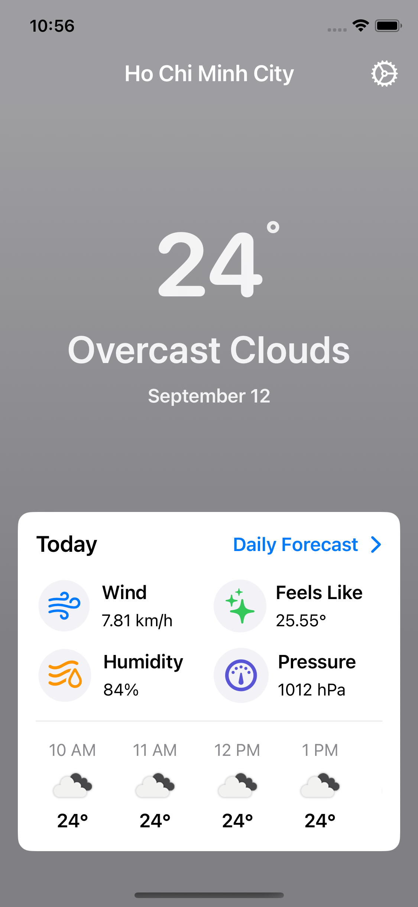
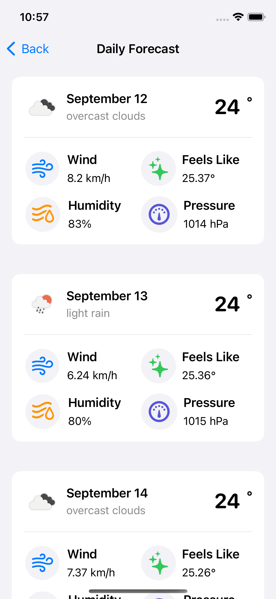
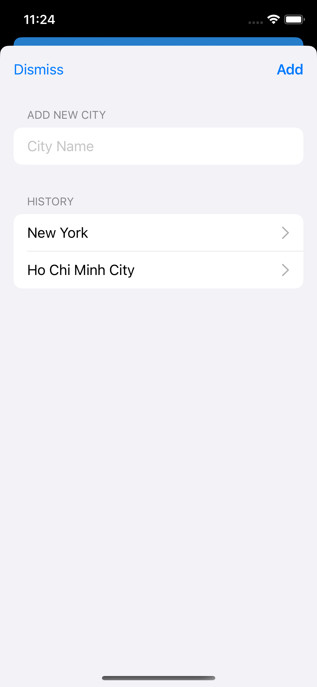
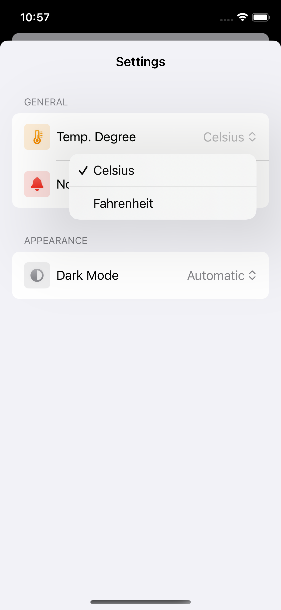
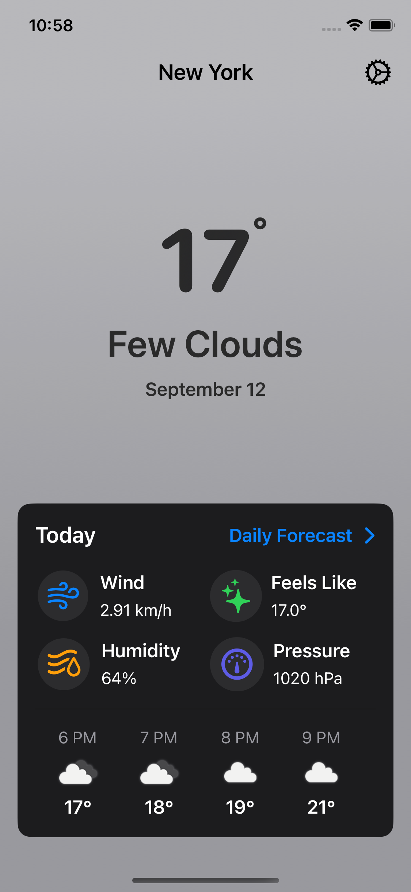
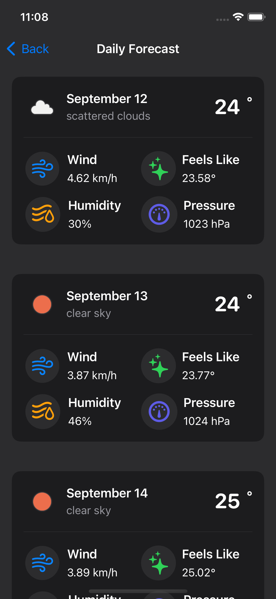
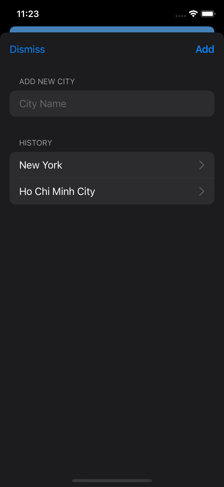
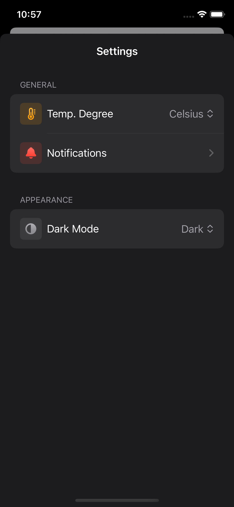

### Project: Advanced Weather App

**Description:**
Develop an advanced weather app that provides real-time weather updates, forecasts, and weather-related notifications. The app will offer a rich user interface with animations, and detailed weather data.

**Technologies:**
- Swift
- SwiftUI
- Combine
- UserDefaults
- Local Notification
- Localization
- Network
- Core Location
- Xcodegen

**Key Features:**

1. **Real-Time Weather Updates:**
   - Fetch current weather data from a reliable weather API.
   - Display current temperature, humidity, wind speed, and other relevant information.

2. **Weather Forecast:**
   - Provide detailed weather forecasts for the next 7-10 days.
   - Display hourly forecasts and trends.

5. **Location Services:**
   - Use Core Location to fetch the user's current location and provide local weather data.
   - Allow users to save multiple locations for quick access to weather data.

6. **Notifications:**
   - Implement User Notifications to alert users of daily forecasts.

7. **Light/Dark Mode:**
   - Support light and dark color schemes based on user preferences.

7. **Localization:**
   - Support multiple languages and regions for a global user base.

7. **Local Data Storage:**
   - Use UserDefaults to store user preferences and settings.
   - Cache searched cities for next use.

7. **Reactive Programming:**
   - Use Combine to handle asynchronous data fetching and updates.

10. **RESTful APIs:**
    - Integrate with a weather API (OpenWeatherMap) to fetch weather data.

12. **Project Management:**
    - Use Xcodegen for dependency and project management.

**Screenshots:**
**Light Mode**
**Today Forecast** | **Daily Forecast** | **Add City** | **Settings** |
------------------ | ------------------ | ------------------ | ------------------ |
 |  |  |  |

**Dark Mode**
**Today Forecast** | **Daily Forecast** | **Add City** | **Settings** |
------------------ | ------------------ | ------------------ | ------------------ |
 |  |  |  |
